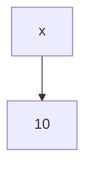
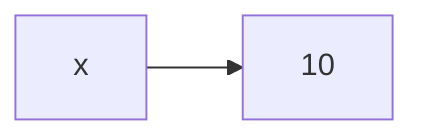
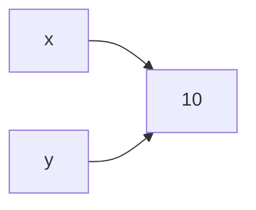
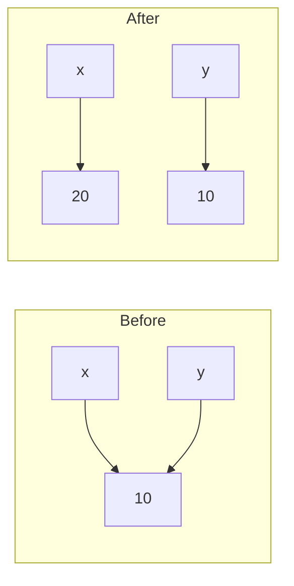
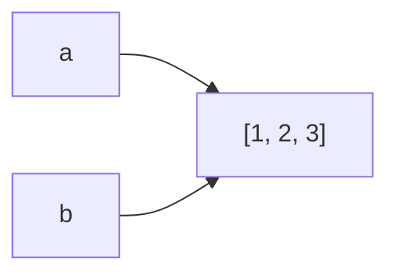
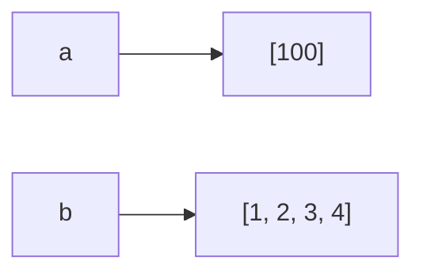
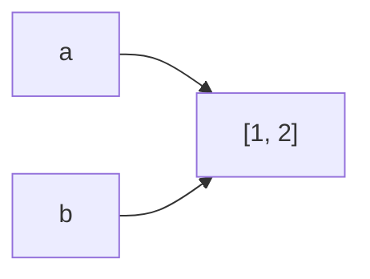
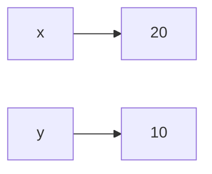

# Variables, Objects, and References

> *"Names refer to objects. Names are introduced by name binding operations."*  
> — Python Language Reference

### Introduction

One of the biggest differences between Python and languages such as C or C++ is how variables work.

Many beginners think a variable **stores** a value.

In Python, that mental model is inaccurate.

A Python variable does **not** contain the object itself.

Instead, a variable is simply a **name (reference)** that points to an object stored somewhere in memory.

Understanding this concept is essential because it explains:

- Why assigning one variable to another doesn't create a copy.
- Why modifying a list affects other variables.
- Why immutable objects behave differently.
- Why shallow and deep copies exist.
- Why function arguments sometimes modify the original object.

These concepts appear repeatedly in technical interviews.

---

## The Mental Model

Think of memory as a warehouse.

Objects live inside the warehouse.

Variables are labels attached to those objects.



The variable `x` doesn't **contain** `10`.

It simply points to the integer object.

---

### Creating an Object

```python
x = 10
```

Python performs several steps behind the scenes:

1. Creates (or reuses) the integer object `10`.
2. Creates the variable `x`.
3. Makes `x` reference that object.



Notice that the object exists independently of the variable.

---

### Multiple Variables Can Reference the Same Object

```python
x = 10
y = x
```

Memory now looks like this.



Both variables reference the **same object**.

Python does **not** create another integer.

---

### Reassignment Does Not Modify the Object

Suppose we write:

```python
x = 10
y = x

x = 20
```

Many beginners expect `y` to become `20`.

It doesn't.

Instead:



The integer `10` was never modified.

The variable `x` simply started pointing somewhere else.

---

### Everything in Python Is an Object

Almost everything you use in Python is an object.

```python
number = 10

text = "hello"

items = [1, 2, 3]

person = {"name": "Alice"}

flag = True

nothing = None
```

Integers.

Strings.

Lists.

Functions.

Classes.

Even modules.

Everything is represented as an object.

---

### Variables Are Just Names

Consider this code.

```python
a = [1, 2, 3]

b = a
```

Memory



Only one list exists.

Both variables point to it.

---

### Modifying the Object

Now suppose we do this.

```python
a.append(4)
```

Result

```python
print(a)

[1, 2, 3, 4]

print(b)

[1, 2, 3, 4]
```

Why?

Because there is only **one list**.

Both variables reference the same object.

---

### Reassigning the Variable

Now instead write:

```python
a = [100]
```

Memory



A new list was created.

Only `a` points to it.

The original list still exists because `b` references it.

---

## Pythonic Example

```python
numbers = [1, 2, 3]

alias = numbers

numbers.append(4)

print(alias)
```

Output

```python
[1, 2, 3, 4]
```

---

## Common Interview Question

What is the output?

```python
a = [1, 2]

b = a

a.append(3)

print(b)
```

Output

```python
[1, 2, 3]
```

No copy was made.

---

### Another Example

```python
x = 10

y = x

x = 20

print(y)
```

Output

```python
10
```

Why?

Because integers are immutable.

`x = 20` creates a different reference.

---

## Visual Comparison

### Mutable Object



Modify list

↓

Both variables observe the change.

---

### Immutable Object


Reassign



No object changed.

Only the reference changed.

---

## Why This Matters in DSA

Many interview bugs happen because candidates accidentally modify shared objects.

Example

```python
matrix = [[0] * 3] * 3
```

Many expect

```
0 0 0
0 0 0
0 0 0
```

Instead

Every row references the same list.

We'll revisit this in the **Mutable vs Immutable** chapter.

---

## Common Interview Problems

Understanding references helps with:

- Copy List
- Clone Graph
- Deep Copy
- Merge Intervals
- Matrix problems
- DFS
- BFS
- Dynamic Programming memoization

---

## Common Mistakes

### Mistake 1

Thinking variables store values.

Incorrect mental model.

Variables store references.

---

### Mistake 2

Expecting assignment to create copies.

```python
a = [1]

b = a
```

No copy.

---

### Mistake 3

Confusing reassignment with mutation.

```python
a = [1]

a = [2]
```

This creates a new object.

It does not modify the previous one.

---

## Best Practices

- Remember that assignment never creates a copy.
- Be careful when passing mutable objects to functions.
- Use `.copy()` or the `copy` module when necessary.
- Draw memory diagrams if you're unsure what happens.

---

## Key Takeaways

- Variables are names.
- Objects live in memory.
- Variables reference objects.
- Assignment copies references, not objects.
- Reassignment changes the reference.
- Mutation changes the object.
- Understanding references makes later topics such as copying and mutability much easier.

---

## Related Topics

- Python Memory Model
- Mutable vs Immutable Objects
- Assignment vs Copying
- Equality vs Identity

---

## Practice Questions

1. What is the difference between a variable and an object?
2. Why does `b` change when `a.append()` is called?
3. Why doesn't `y` change after `x = 20`?
4. Draw the memory diagram for:

```python
a = [1]
b = a
a.append(2)
```

5. What happens when multiple variables reference the same object?

---

## Summary

Python variables are references, not containers.

Once you understand this simple idea, many seemingly strange Python behaviors become completely logical.

This mental model forms the foundation for the next topics, where we'll explore how Python manages memory, why mutable and immutable objects behave differently, and how copying actually works.
