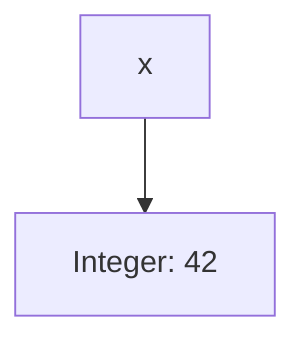
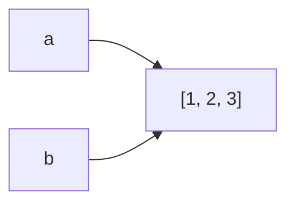
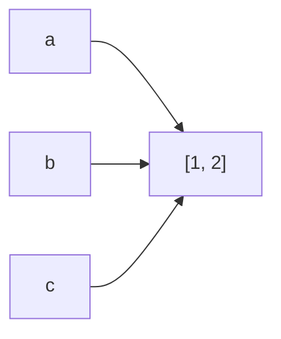
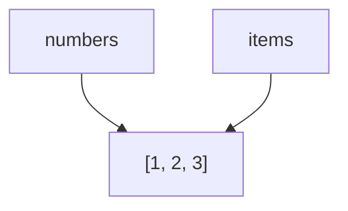
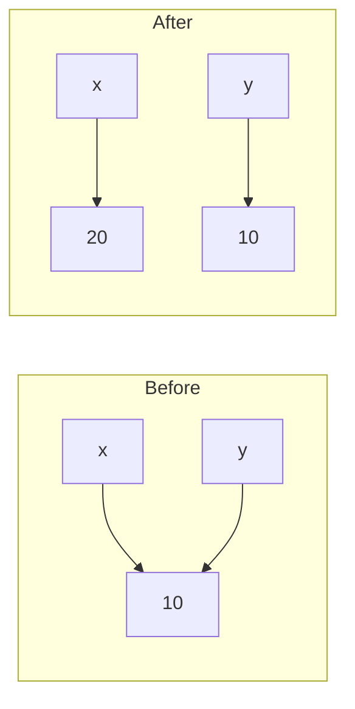
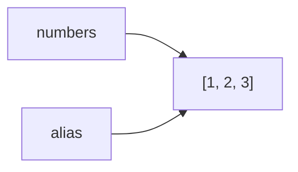

# Python Memory Model

> *"Explicit is better than implicit."*  
> — **The Zen of Python**

### Introduction

In the previous chapter, we learned that Python variables do not store values directly. Instead, they store **references** to objects.

The next question naturally becomes:

> **Where do these objects live, and what happens to them when they're no longer needed?**

Understanding Python's memory model will help you reason about variable assignment, function calls, object lifetime, and performance during coding interviews.

---

## What Is the Python Memory Model?

Whenever you create a value in Python, an **object** is created in memory.

For example:

```python
x = 42
```

Python creates an integer object representing `42` and binds the name `x` to that object.



The object exists independently of the variable.

---

## Every Value Is an Object

In Python, almost everything is an object.

```python
number = 10
text = "Python"
values = [1, 2, 3]
person = {"name": "Alice"}
flag = True
```

Regardless of the type, Python stores each of these as an object in memory.

---

## Names and Objects

A variable is simply a name that refers to an object.

```python
a = [1, 2, 3]
b = a
```



There is only **one list object**.

Both variables point to it.

---

## Object Lifetime

An object remains in memory as long as at least one reference points to it.

```python
numbers = [1, 2, 3]
```

The list exists because `numbers` references it.

If we later write:

```python
numbers = None
```

The original list is no longer referenced.

If no other references exist, Python can reclaim the memory.

---

## Garbage Collection

Python automatically manages memory using **garbage collection**.

Unlike languages such as C or C++, you do not manually free memory.

For example:

```python
values = [1, 2, 3]

values = None
```

Once the list has no remaining references, Python is free to remove it from memory.

This automatic memory management reduces many common programming errors such as memory leaks and dangling pointers.

---

## Reference Counting

The primary mechanism Python uses to manage memory is **reference counting**.

Every object keeps track of how many references point to it.

Example:

```python
a = [1, 2]

b = a

c = a
```



Reference Count = **3**

If one variable is reassigned:

```python
c = None
```

Reference Count = **2**

When the count reaches zero, the object becomes eligible for garbage collection.

---

## Function Calls and References

Function arguments are also references.

```python
def print_items(items):
    print(items)

numbers = [1, 2, 3]

print_items(numbers)
```



No copy of the list is created.

The parameter `items` simply references the same object.

This is one reason mutable objects can be modified inside functions.

---

## Immutable Objects

Immutable objects cannot be modified after creation.

```python
x = 10

y = x

x = 20
```



The integer `10` never changes.

Instead, `x` begins referencing a different object.

---

## Mutable Objects

Mutable objects can be modified without creating a new object.

```python
numbers = [1, 2]

alias = numbers

numbers.append(3)
```



Both variables observe the modification because they reference the same list.

---

## Why This Matters in Coding Interviews

Many interview bugs occur because candidates misunderstand object references.

Consider this example:

```python
matrix = [[0] * 3] * 3

matrix[0][0] = 1

print(matrix)
```

Output:

```python
[
    [1, 0, 0],
    [1, 0, 0],
    [1, 0, 0]
]
```

Why?

Because every row references the same inner list.

Understanding the memory model makes this behavior completely predictable.

---

## Performance Considerations

Creating a new object generally requires more work than reusing an existing one.

Examples:

```python
numbers.append(5)
```

Modifies the existing list.

Whereas:

```python
numbers = numbers + [5]
```

Creates an entirely new list.

Knowing the difference can improve both runtime and memory usage.

---

## Common Interview Questions

Understanding Python's memory model helps with:

- Copy List
- Clone Graph
- Deep Copy
- Merge Intervals
- Matrix manipulation
- DFS
- BFS
- Recursive algorithms
- Dynamic Programming memoization

---

## Common Mistakes

### Mistake 1

Assuming assignment creates a copy.

```python
b = a
```

It does not.

---

### Mistake 2

Confusing mutation with reassignment.

```python
numbers.append(5)
```

Mutates the existing object.

```python
numbers = numbers + [5]
```

Creates a new object.

---

### Mistake 3

Ignoring shared references.

Multiple variables can refer to the same object.

Modifying the object affects every reference.

---

## Best Practices

- Understand that variables hold references.
- Avoid unintended shared mutable objects.
- Copy objects explicitly when needed.
- Think about object lifetime when debugging.

---

## Key Takeaways

- Python stores objects in memory.
- Variables are names that reference those objects.
- Objects remain alive while references exist.
- Python automatically manages memory using garbage collection.
- Reference counting determines when objects can be reclaimed.
- Mutable and immutable objects behave differently because of the way references work.

---

## Related Topics

- Variables, Objects & References
- Mutable vs Immutable Objects
- Assignment vs Copying
- Equality vs Identity

---

## Practice Questions

1. What happens when the last reference to an object disappears?
2. Why doesn't assigning one variable to another create a copy?
3. What is reference counting?
4. Why does modifying a list affect every variable pointing to it?
5. Why are immutable objects safer to share between variables?

---

## Summary

Python's memory model is built around **objects**, **references**, and **automatic memory management**.

Understanding these concepts helps explain many of Python's most important behaviors, from assignment and function calls to copying and mutation.

In the next chapter, we'll build on this foundation by exploring one of the most frequently tested Python concepts in coding interviews:

**Mutable vs Immutable Objects.**
