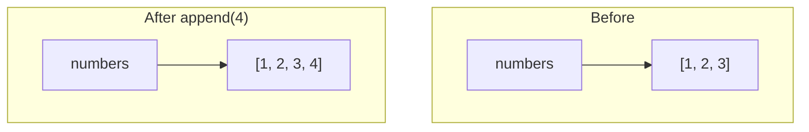
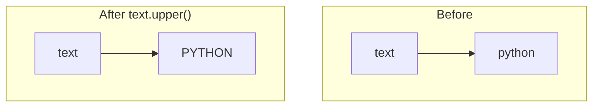
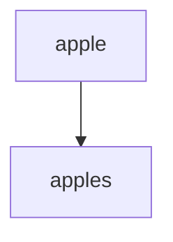
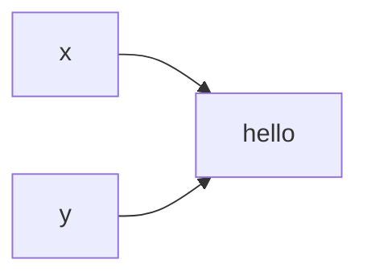

# Mutable vs Immutable Objects

> *"Special cases aren't special enough to break the rules."*  
> — **The Zen of Python**

### Introduction

One of the most frequently tested Python concepts in coding interviews is the difference between **mutable** and **immutable** objects.

Many seemingly strange behaviors in Python become easy to understand once you know whether an object can be modified after it is created.

This chapter builds directly on the previous discussions about objects, references, and Python's memory model.

---

## What Does Mutable Mean?

A mutable object can be **modified after it has been created**.

Its contents may change while the object itself remains the same.

Example:

```python
numbers = [1, 2, 3]

numbers.append(4)

print(numbers)
```

Output

```python
[1, 2, 3, 4]
```

The same list object now contains different values.

---

## What Does Immutable Mean?

An immutable object **cannot be changed after creation**.

Any apparent modification actually creates a new object.

Example

```python
text = "python"

text = text.upper()

print(text)
```

Output

```python
PYTHON
```

The original string was never modified.

Instead, Python created a brand-new string object.

---

## Common Mutable Types

The following built-in types are mutable.

| Type | Mutable |
|-------|----------|
| list | ✅ |
| dict | ✅ |
| set | ✅ |
| bytearray | ✅ |

These objects can be modified without creating a new object.

Example

```python
student = {
    "name": "Alice"
}

student["age"] = 22
```

The dictionary itself is modified.

---

## Common Immutable Types

The following built-in types are immutable.

| Type | Immutable |
|-------|------------|
| int | ✅ |
| float | ✅ |
| bool | ✅ |
| str | ✅ |
| tuple | ✅ |
| frozenset | ✅ |
| bytes | ✅ |
| NoneType | ✅ |

These objects never change after creation.

---

## Visual Comparison

Mutable object



The same object changed.

---

Immutable object



A completely new object was created.

---

## Why Strings Are Immutable

Consider

```python
word = "apple"

word += "s"
```

Many beginners think Python modifies the string.

It does not.

Internally, Python creates



The old string still exists until it is no longer referenced.

---

## Lists Behave Differently

```python
numbers = [1, 2]

numbers.append(3)
```

Only one list exists.

The existing object changes.

---

## Interview Example

```python
a = [1, 2]

b = a

a.append(3)

print(b)
```

Output

```python
[1, 2, 3]
```

Because both variables reference the same mutable object.

---

Now compare

```python
x = "cat"

y = x

x += "s"

print(y)
```

Output

```python
cat
```

Strings are immutable.

---

## Why Tuples Are Immutable

```python
point = (2, 5)
```

You cannot write

```python
point[0] = 10
```

Python raises

```python
TypeError
```

A tuple's contents never change.

---

## Why Immutability Matters

Immutable objects provide several advantages.

### Safe Sharing

Multiple variables can safely reference the same object.



No variable can accidentally modify it.

---

### Hashability

Dictionary keys must remain constant.

This is why immutable objects are generally hashable.

Example

```python
scores = {
    "Alice": 95
}
```

Strings make excellent dictionary keys.

Lists do not.

---

Attempting

```python
data = {
    [1, 2]: "value"
}
```

raises

```python
TypeError:
unhashable type: 'list'
```

---

### Thread Safety

Immutable objects reduce synchronization issues because they cannot change unexpectedly.

Although interview questions rarely focus on concurrency, this is one reason immutable objects are widely used.

---

## Mutable Default Argument Trap

Consider

```python
def add_item(item, values=[]):
    values.append(item)
    return values
```

Calling

```python
print(add_item(1))

print(add_item(2))
```

Output

```python
[1]

[1, 2]
```

Why?

Because the same list object is reused.

We'll revisit this in **Common Interview Pitfalls**.

---

## Performance Considerations

Appending to a list

```python
numbers.append(5)
```

Usually modifies the existing object.

Time Complexity

```
O(1)
```

Concatenating strings

```python
text += character
```

Creates a new string.

Time Complexity

```
O(n)
```

Doing this repeatedly inside a loop can produce an **O(n²)** solution.

Instead, build a list of characters and use

```python
"".join(parts)
```

We'll cover this in detail in the **Strings** section.

---

## Interview Questions That Depend on Mutability

Understanding mutability helps solve:

- Valid Anagram
- Group Anagrams
- Clone Graph
- Copy List with Random Pointer
- Merge Intervals
- Matrix problems
- DFS
- BFS
- Dynamic Programming

---

## Common Mistakes

### Mistake 1

Thinking strings change in place.

They never do.

---

### Mistake 2

Believing

```python
b = a
```

creates a copy.

It only copies the reference.

---

### Mistake 3

Using mutable objects as dictionary keys.

Lists and dictionaries cannot be hashed.

---

### Mistake 4

Using mutable default arguments.

Always prefer

```python
def function(values=None):
    if values is None:
        values = []
```

---

## Best Practices

- Use tuples for fixed collections.
- Use lists when modification is required.
- Use immutable objects as dictionary keys.
- Avoid repeated string concatenation in loops.
- Copy mutable objects intentionally.

---

## Key Takeaways

- Mutable objects can change after creation.
- Immutable objects never change.
- Assignment copies references, not objects.
- Strings are immutable.
- Lists, dictionaries, and sets are mutable.
- Immutable objects are generally hashable.
- Understanding mutability prevents many common interview bugs.

---

## Related Topics

- Python Memory Model
- Assignment vs Copying
- Equality vs Identity
- Dictionaries
- Sets

---

## Practice Questions

1. Why are strings immutable?
2. Why can't lists be dictionary keys?
3. Why does `list.append()` affect every reference?
4. Why is `"".join()` faster than repeated string concatenation?
5. What problems can mutable default arguments cause?

---

## Summary

Mutability is one of Python's defining characteristics.

Whether an object can change after creation affects copying, hashing, function arguments, performance, and many common interview patterns.

Mastering this concept will make the behavior of Python's built-in data structures much easier to understand throughout the rest of this cookbook.
