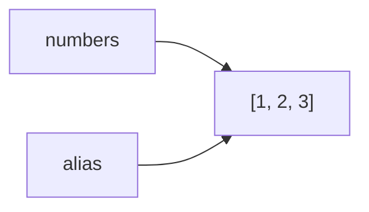
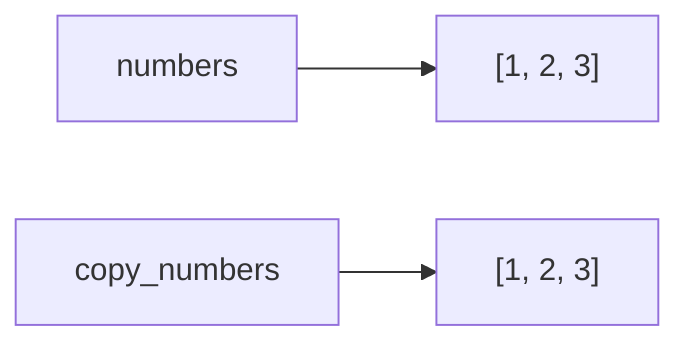
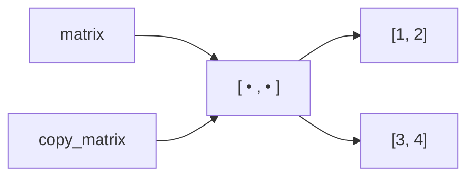
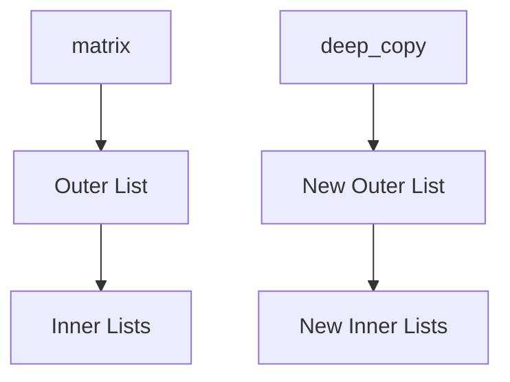

# Assignment vs Copying

> *"In the face of ambiguity, refuse the temptation to guess."*  
> — **The Zen of Python**

### Introduction

One of the most common sources of bugs in Python is confusing **assignment** with **copying**.

Many developers assume that assigning one variable to another creates a new object.

It does not.

Understanding the difference between **assignment**, **shallow copying**, and **deep copying** is essential for writing correct Python programs and succeeding in coding interviews.

---

## Assignment

Assignment simply creates another reference to the same object.

```python
numbers = [1, 2, 3]

alias = numbers
```

Memory



There is only **one list object**.

Both variables refer to the same object.

---

### Modifying Through Either Variable

```python
numbers.append(4)

print(alias)
```

Output

```python
[1, 2, 3, 4]
```

The list changes because both variables reference the same object.

---

## Copying

A copy creates a **new object**.

For lists, the simplest approach is:

```python
numbers = [1, 2, 3]

copy_numbers = numbers.copy()
```

Memory



Now two different list objects exist.

---

### Modifying the Copy

```python
copy_numbers.append(4)

print(numbers)

print(copy_numbers)
```

Output

```python
[1, 2, 3]

[1, 2, 3, 4]
```

The original list is unchanged.

---

## Ways to Copy a List

### Using `.copy()`

```python
copy_list = original.copy()
```

---

### Using Slicing

```python
copy_list = original[:]
```

---

### Using `list()`

```python
copy_list = list(original)
```

---

### Using the `copy` Module

```python
import copy

copy_list = copy.copy(original)
```

All of these create a **shallow copy**.

---

## What Is a Shallow Copy?

A shallow copy duplicates only the outer container.

Nested objects are still shared.

Example

```python
matrix = [
    [1, 2],
    [3, 4]
]

copy_matrix = matrix.copy()
```

Memory



The outer list is copied.

The inner lists are shared.

---

### Interview Example

```python
matrix = [
    [1, 2],
    [3, 4]
]

copy_matrix = matrix.copy()

copy_matrix[0][0] = 100

print(matrix)
```

Output

```python
[
    [100, 2],
    [3, 4]
]
```

Why?

Because both matrices reference the same inner list.

---

## Deep Copy

A deep copy duplicates **every nested object**.

Python provides this through the `copy` module.

```python
import copy

matrix = [
    [1, 2],
    [3, 4]
]

deep_copy = copy.deepcopy(matrix)
```

Now every nested list is copied.



The two structures are completely independent.

---

### Modifying a Deep Copy

```python
deep_copy[0][0] = 999

print(matrix)
```

Output

```python
[
    [1, 2],
    [3, 4]
]
```

The original object remains unchanged.

---

## Assignment vs Shallow Copy vs Deep Copy

| Operation | New Outer Object | New Nested Objects |
|------------|------------------|--------------------|
| Assignment | ❌ | ❌ |
| Shallow Copy | ✅ | ❌ |
| Deep Copy | ✅ | ✅ |

---

## Performance Comparison

| Operation | Time | Space |
|------------|------|-------|
| Assignment | O(1) | O(1) |
| Shallow Copy | O(n) | O(n) |
| Deep Copy | O(total objects) | O(total objects) |

Deep copying is significantly more expensive because every nested object must also be duplicated.

---

## When Should You Use Each?

#### Assignment

Use when you intentionally want multiple variables to reference the same object.

---

#### Shallow Copy

Use when the object contains only immutable elements or when shared nested objects are acceptable.

---

#### Deep Copy

Use when every part of the object must be independent.

This is common for:

- Graph cloning
- Matrix manipulation
- Backtracking
- Game state exploration
- Recursive search algorithms

---

## Common Interview Problems

Understanding copying is important for:

- Clone Graph
- Copy List with Random Pointer
- Sudoku Solver
- N-Queens
- Word Search
- DFS
- Backtracking
- Matrix problems

---

## Common Mistakes

### Mistake 1

Believing assignment creates a copy.

```python
b = a
```

It does not.

---

### Mistake 2

Thinking `.copy()` duplicates nested objects.

It only copies the outer container.

---

### Mistake 3

Using shallow copy for deeply nested data.

Unexpected modifications often result.

---

### Mistake 4

Using `deepcopy()` unnecessarily.

Deep copying large structures can be slow and memory-intensive.

---

## Best Practices

- Use assignment when shared ownership is intended.
- Use shallow copy for flat collections.
- Use deep copy only when truly necessary.
- Be cautious when copying nested lists or dictionaries.

---

## Key Takeaways

- Assignment copies references.
- Shallow copy duplicates only the outer object.
- Deep copy duplicates every nested object.
- Nested mutable objects remain shared in a shallow copy.
- Understanding these differences prevents subtle bugs.

---

## Related Topics

- Variables, Objects & References
- Python Memory Model
- Mutable vs Immutable Objects
- Equality vs Identity

---

## Practice Questions

1. What is the difference between assignment and copying?
2. Why does a shallow copy still share nested lists?
3. When should you use `deepcopy()`?
4. Why is `deepcopy()` slower than `.copy()`?
5. Which copy operation is performed by slicing (`[:]`)?

---

## Summary

Assignment, shallow copying, and deep copying each serve different purposes.

Understanding how they work—and more importantly, **what they do not copy**—is essential for writing correct Python code.

Many interview questions involving matrices, graphs, recursion, and backtracking depend on this knowledge.

In the next chapter, we'll explore another frequently misunderstood topic:

**Equality (`==`) vs Identity (`is`)**, and learn how Python compares objects under the hood.
  