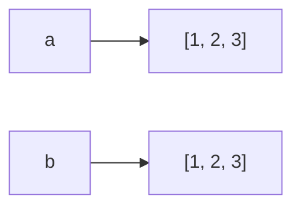
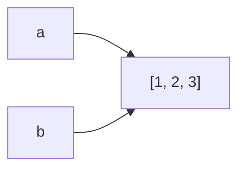

# Equality (`==`) vs Identity (`is`)

> *"There should be one—and preferably only one—obvious way to do it."*  
> — **The Zen of Python**

### Introduction

Python provides two different ways to compare objects:

- `==` checks whether **two objects have the same value**.
- `is` checks whether **two variables refer to the exact same object in memory**.

Understanding this distinction is essential for writing correct Python code and answering common interview questions.

---

## Equality (`==`)

The equality operator compares **values**.

```python
a = [1, 2, 3]
b = [1, 2, 3]

print(a == b)
```

Output

```python
True
```

Although `a` and `b` are different objects, they contain the same values.

---

## Identity (`is`)

The identity operator compares **object identity**.

```python
a = [1, 2, 3]
b = [1, 2, 3]

print(a is b)
```

Output

```python
False
```

Two separate list objects were created.

---

## Visual Comparison



- `a == b` → ✅ `True`
- `a is b` → ❌ `False`

The values are equal, but the objects are different.

---

## Shared References

```python
a = [1, 2, 3]

b = a
```



Now

```python
a == b
```

returns

```python
True
```

and

```python
a is b
```

also returns

```python
True
```

because both variables reference the same object.

---

## The `id()` Function

Every Python object has an identity.

You can inspect it using `id()`.

```python
a = [1, 2]

b = a

print(id(a))
print(id(b))
```

Example output

```python
4372864512
4372864512
```

The IDs are identical because both variables reference the same object.

---

Different objects have different IDs.

```python
a = [1]
b = [1]

print(id(a))
print(id(b))
```

The IDs will differ.

---

## Why `None` Should Always Use `is`

The recommended way to compare with `None` is:

```python
if value is None:
    ...
```

Not

```python
if value == None:
    ...
```

Why?

`None` is a singleton object.

There is only one `None` instance in a Python program.

Identity comparison is both faster and semantically correct.

---

## Integer Caching

Python caches small integers to improve performance.

Example

```python
a = 100
b = 100

print(a is b)
```

Often outputs

```python
True
```

Now try

```python
a = 1000
b = 1000

print(a is b)
```

Depending on the Python implementation and execution context, this may return either `True` or `False`.

**Never rely on `is` when comparing numbers.**

Use `==`.

---

## String Interning

Python may also reuse identical string objects.

```python
a = "python"
b = "python"

print(a is b)
```

This may return

```python
True
```

because Python often interns strings.

However, this is an implementation optimization.

Do not rely on it.

Always compare strings using

```python
==
```

---

## Custom Objects

Consider

```python
class Student:
    pass

a = Student()
b = Student()
```

```python
a == b
```

returns

```python
False
```

because two different objects were created.

Likewise,

```python
a is b
```

also returns

```python
False
```

---

## When to Use `==`

Use `==` when comparing:

- Numbers
- Strings
- Lists
- Tuples
- Dictionaries
- Sets
- Custom values

Example

```python
password == expected_password
```

---

## When to Use `is`

Use `is` for:

- `None`
- `True` and `False` (rarely needed)
- Singleton objects
- Explicit identity checks

Example

```python
if node is None:
    return
```

---

## Time Complexity

Both operations are generally **O(1)**.

However:

- `==` may compare multiple elements (for example, two long lists), making it **O(n)** in the worst case.
- `is` only compares object identity and is always **O(1)**.

---

## Common Interview Problems

Understanding equality and identity is useful for:

- Linked Lists
- Graphs
- Trees
- Memoization
- Object-Oriented Design
- Caching
- Singleton Pattern

---

## Common Mistakes

### Mistake 1

Using

```python
if value == None
```

Instead use

```python
if value is None
```

---

### Mistake 2

Comparing strings using

```python
is
```

Always use

```python
==
```

---

### Mistake 3

Assuming equal objects share memory.

```python
[1, 2] == [1, 2]
```

does not mean

```python
[1, 2] is [1, 2]
```

---

### Mistake 4

Relying on integer caching.

Never write code that depends on

```python
100 is 100
```

or

```python
1000 is 1000
```

Always compare numeric values with `==`.

---

## Best Practices

- Use `==` to compare values.
- Use `is` to compare identity.
- Compare with `None` using `is`.
- Do not rely on Python's object caching.
- Use `id()` only for debugging and learning.

---

## Key Takeaways

- `==` compares values.
- `is` compares object identity.
- Two equal objects may not be the same object.
- `None` should always be compared using `is`.
- Integer and string caching are implementation optimizations and should not influence your code.

---

## Related Topics

- Variables, Objects & References
- Python Memory Model
- Mutable vs Immutable Objects
- Assignment vs Copying

---

## Practice Questions

1. What is the difference between `==` and `is`?
2. Why should `None` be compared using `is`?
3. What does `id()` return?
4. Why shouldn't you rely on integer caching?
5. Can two different objects be equal?

---

## Summary

Python distinguishes between **value equality** and **object identity**.

Understanding the difference helps you avoid subtle bugs and write clearer, more idiomatic Python.

As a rule of thumb:

- Use `==` when comparing values.
- Use `is` when checking identity, especially with `None`.

This distinction is simple, but it appears regularly in technical interviews and production code.
