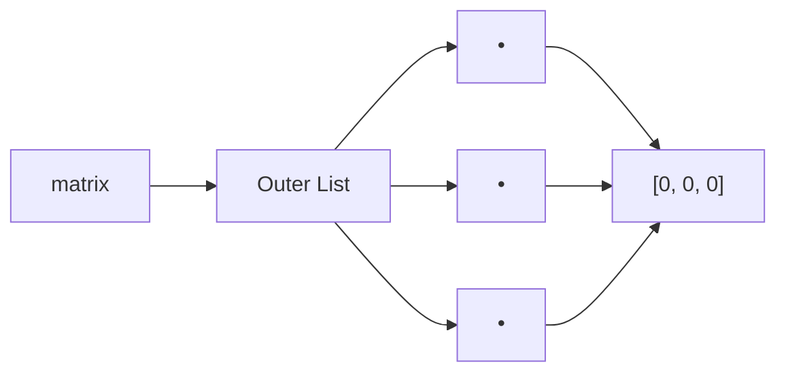

# Common Python Pitfalls in Coding Interviews

> *"Most interview bugs aren't algorithmic—they're language-specific."*

### Introduction

Even experienced Python developers occasionally run into subtle language behaviors that lead to incorrect solutions, poor performance, or unnecessary debugging during coding interviews.

This chapter collects the most common Python pitfalls you'll encounter while solving Data Structures and Algorithms (DSA) problems.

Many of these appear repeatedly on platforms like LeetCode, HackerRank, Codeforces, and in FAANG interviews.

---

## 1. Assignment Does Not Create a Copy

❌ Incorrect

```python
a = [1, 2, 3]
b = a

b.append(4)

print(a)
```

Output

```python
[1, 2, 3, 4]
```

Both variables reference the same list.

✅ Correct

```python
b = a.copy()
```

or

```python
b = a[:]
```

---

## 2. Mutable Default Arguments

❌ Incorrect

```python
def add(value, nums=[]):
    nums.append(value)
    return nums
```

```python
print(add(1))
print(add(2))
```

Output

```python
[1]
[1, 2]
```

The default list is reused across function calls.

✅ Correct

```python
def add(value, nums=None):
    if nums is None:
        nums = []

    nums.append(value)
    return nums
```

---

## 3. Repeated String Concatenation

❌

```python
result = ""

for ch in word:
    result += ch
```

Each concatenation creates a new string.

Time Complexity

```
O(n²)
```

✅ Better

```python
parts = []

for ch in word:
    parts.append(ch)

result = "".join(parts)
```

Time Complexity

```
O(n)
```

---

## 4. Using `list.pop(0)`

```python
queue.pop(0)
```

This shifts every remaining element.

Time Complexity

```
O(n)
```

Instead

```python
from collections import deque

queue = deque()

queue.popleft()
```

Time Complexity

```
O(1)
```

---

## 5. Membership Checks on Lists

❌

```python
if target in nums:
```

inside another loop.

Time Complexity

```
O(n²)
```

Better

```python
lookup = set(nums)
```

Lookups become approximately

```
O(1)
```

---

## 6. Using `== None`

❌

```python
if node == None:
```

✅

```python
if node is None:
```

---

## 7. Modifying a List While Iterating

❌

```python
nums = [1, 2, 3, 4]

for num in nums:
    if num % 2 == 0:
        nums.remove(num)
```

Unexpected elements may be skipped.

Better

```python
nums = [num for num in nums if num % 2 != 0]
```

---

## 8. Multiplying Nested Lists

❌

```python
matrix = [[0] * 3] * 3
```

Memory



All rows point to the same list.

Correct

```python
matrix = [[0] * 3 for _ in range(3)]
```

---

## 9. Forgetting Integer Division

❌

```python
mid = (left + right) / 2
```

Produces a float.

Correct

```python
mid = (left + right) // 2
```

---

## 10. Using Lists Instead of Sets

Need

```text
Contains?
Visited?
Already Seen?
```

Use

```python
set()
```

not

```python
list()
```

---

## 11. Forgetting That Strings Are Immutable

❌

```python
word[0] = "A"
```

Raises

```python
TypeError
```

Instead

```python
chars = list(word)

chars[0] = "A"

word = "".join(chars)
```

---

## 12. Assuming Dictionary Membership Checks Values

```python
person = {
    "age": 20
}

20 in person
```

Output

```python
False
```

Dictionary membership checks **keys**.

Use

```python
20 in person.values()
```

to search values.

---

## 13. Forgetting Empty Collections Are Falsy

Instead of

```python
if len(stack) > 0:
```

write

```python
if stack:
```

Instead of

```python
if len(queue) == 0:
```

write

```python
if not queue:
```

---

## 14. Creating Expensive Objects Inside Loops

❌

```python
for num in nums:
    lookup = set(nums)
```

Creates a new hash table every iteration.

Correct

```python
lookup = set(nums)

for num in nums:
    ...
```

---

## 15. Forgetting to Import the Right Module

Many interview problems become significantly easier using Python's standard library.

Know these imports:

```python
from collections import Counter
from collections import defaultdict
from collections import deque

import heapq
import bisect
import math
import itertools
```

We'll cover each of these in later chapters.

---

## Quick Checklist Before Submitting

- Did I accidentally mutate shared objects?
- Am I using a list where a set would be faster?
- Am I repeatedly concatenating strings?
- Am I using `deque` instead of `list.pop(0)`?
- Did I accidentally create shallow copies?
- Am I modifying a collection while iterating?
- Did I use `//` instead of `/` for indices?
- Am I comparing `None` with `is`?
- Can I reduce the complexity using a hash table?

---

## Key Takeaways

- Most Python interview bugs come from misunderstanding object references, mutability, or data structure performance.
- Always think about both **correctness** and **time complexity**.
- Python's standard library often provides an optimized solution—know when to use it.
- A small language-specific mistake can turn an optimal algorithm into a failing solution.

---

## Related Topics

- Mutable vs Immutable Objects
- Assignment vs Copying
- Membership Operators
- Time Complexity
- Python Standard Library

---

## Summary

These pitfalls are responsible for a large percentage of failed coding interview submissions—not because the algorithm is wrong, but because the Python implementation is inefficient or subtly incorrect.

As you solve more problems, this checklist will become second nature and help you write cleaner, faster, and more idiomatic Python solutions.
