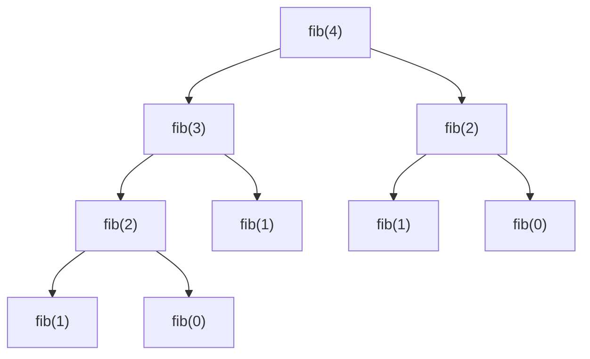

# Recursion Tree

> A visual representation of all recursive calls made during the execution of a function.

---

## Introduction

While the "Leap of Faith" is the best way to write a recursive function, drawing a **Recursion Tree** is the best way to understand its time and space complexity. 

During an interview, drawing a recursion tree is highly recommended when dealing with recursive branching (like generating permutations, subsets, or calculating Fibonacci numbers).

---

## What is it?

A recursion tree maps out the execution flow of a recursive algorithm. 
- Each **node** represents a single function call with its specific arguments.
- Each **edge** represents a recursive call made by that function.
- The **root** is the initial function call.
- The **leaves** are the base cases where the recursion stops.

---

## Visualizing Fibonacci

Consider the naive recursive approach to calculating the $n$-th Fibonacci number:

```python
def fib(n: int) -> int:
    if n <= 1:
        return n
    return fib(n - 1) + fib(n - 2)
```

If we call `fib(4)`, the function makes two branches at every step. Let's visualize this using a Mermaid diagram:



---

## Calculating Time Complexity

To find the time complexity of a recursive algorithm, you calculate the total number of nodes in the recursion tree.

For `fib(4)`, notice that every non-leaf node branches into 2 smaller nodes. 
- Level 0: 1 node (`fib(4)`)
- Level 1: 2 nodes
- Level 2: 4 nodes
- Level 3: 8 nodes (maximum)

The total number of nodes in a perfectly balanced binary tree of height $n$ is $2^{n+1} - 1$. Therefore, the time complexity of the naive Fibonacci algorithm is $O(2^n)$.

### The Branching Factor Formula

A quick shortcut for estimating time complexity is:
$O(\text{branches}^{\text{depth}})$

In `fib(n)`, each call branches $2$ times, and the maximum depth is $n$. Thus, $O(2^n)$.

---

## Calculating Space Complexity

The space complexity is determined by the **maximum depth of the recursion tree**.

This is because Python executes depth-first. It fully explores the left side of the tree before evaluating the right side. It only needs to keep the *current path* in memory (on the Call Stack).

In `fib(n)`, the longest path from the root to a leaf is `fib(n) -> fib(n-1) -> fib(n-2) ... -> fib(1)`. The length of this path is $n$.
Therefore, the space complexity is $O(n)$.

---

## Why Drawing Trees Helps in Interviews

1. **Identifying Overlapping Subproblems:** Looking at the `fib(4)` tree above, you can see that `fib(2)` is computed twice. This is the exact moment you tell the interviewer: *"We are doing redundant work. I can optimize this using Dynamic Programming (Memoization)."*
2. **Finding the Space Complexity:** Interviewers love asking for the space complexity of recursive functions. If you know the max depth of your tree, you know the space complexity.

---

## Key Takeaways

- Draw a recursion tree when your function makes more than one recursive call.
- **Time Complexity** $\approx O(\text{branches}^{\text{depth}})$.
- **Space Complexity** = $O(\text{maximum depth of the tree})$.
- If nodes with the exact same arguments appear multiple times, you should use Memoization.

---

## Related Topics

- [Recursion Basics](02-recursion-basics.md)
- [Call Stack](05-call-stack.md)
- [Memoization](../part-14-dynamic-programming/03-memoization.md)
