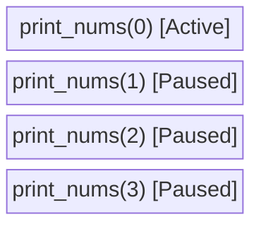

# The Call Stack

> The hidden data structure that recursion uses to remember where it left off.

---

## Introduction

Understanding the call stack is the key to understanding *why* recursion requires $O(N)$ space and *how* backtracking works. 

When you write a recursive function, you do not need to explicitly create a `Stack` data structure, because the operating system provides one for you behind the scenes: the Call Stack.

---

## What is it?

The Call Stack is a LIFO (Last-In, First-Out) memory structure used by Python to keep track of active function calls.

Whenever a function is called:
1. Python creates a "Stack Frame".
2. This frame contains the function's local variables, arguments, and the exact line number where the function was called.
3. The frame is pushed onto the top of the Call Stack.
4. Python begins executing the new function.

Whenever a function `return`s:
1. Python pops the top frame off the Call Stack.
2. It resumes execution of the function directly below it, exactly where it left off.

---

## Visualizing the Call Stack

Let's look at a simple recursive function that prints numbers:

```python
def print_nums(n: int):
    if n == 0:
        return
    print_nums(n - 1)
    print(n)

print_nums(3)
```

**Step-by-Step Execution:**
1. `print_nums(3)` is called. A frame is pushed. It pauses to call `print_nums(2)`.
2. `print_nums(2)` is called. A frame is pushed. It pauses to call `print_nums(1)`.
3. `print_nums(1)` is called. A frame is pushed. It pauses to call `print_nums(0)`.
4. `print_nums(0)` is called. This is the base case! It `return`s immediately.

At this exact moment (the maximum depth), the Call Stack looks like this:



**Unrolling the Stack:**
5. `print_nums(0)` pops off.
6. `print_nums(1)` resumes where it paused. It runs `print(1)`. Then it implicitly `return`s and pops off.
7. `print_nums(2)` resumes where it paused. It runs `print(2)`. Then it pops off.
8. `print_nums(3)` resumes where it paused. It runs `print(3)`. Then it pops off.

**Output:**
```
1
2
3
```

Notice that the numbers are printed in *ascending* order, even though we counted down! This happens because the `print` statement executes *after* the recursive call returns (during the unrolling phase).

---

## Space Complexity

The space complexity of a recursive function is strictly determined by the maximum number of frames on the Call Stack at any given time.

If your function recurses $N$ times before hitting the base case, there will be $N$ frames stacked on top of each other. This results in an $O(N)$ space complexity.

---

## Python's Recursion Limit

Because the Call Stack uses physical memory, it is not infinite. 

To prevent a runaway infinite loop from crashing your entire computer by exhausting RAM (a Stack Overflow), Python imposes a strict recursion limit.

By default, Python's recursion limit is **1000**.
If your recursion goes deeper than 1000 calls, Python throws a `RecursionError`.

If you are solving an interview problem where the input size (like a Tree height or Array length) can exceed 1000, you MUST use an iterative approach (using a `while` loop and a manual list/stack) instead of recursion.

---

## Key Takeaways

- Every recursive call creates a new frame on the Call Stack.
- The Call Stack consumes $O(\text{Max Depth})$ memory space.
- Code written *after* the recursive call executes in reverse order as the stack unrolls (essential for Backtracking).
- Python has a default recursion limit of 1000.

---

## Related Topics

- [Base Case](04-base-case.md)
- [Recursion Tree](03-recursion-tree.md)
- [Backtracking vs Recursion](08-backtracking-vs-recursion.md)
- [Recursion Limit](../part-12-interview-pitfalls/05-recursion-limit.md)
