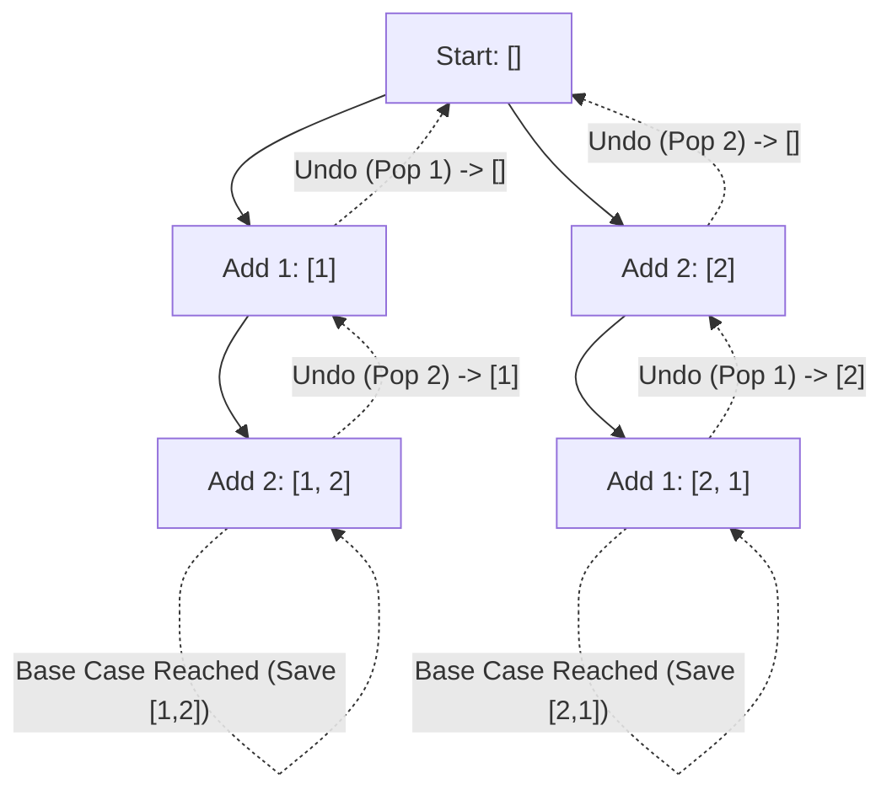

# Backtracking vs Recursion

> All backtracking is recursion, but not all recursion is backtracking.

---

## Introduction

Backtracking is one of the most common algorithmic patterns tested in FAANG interviews. It is heavily used for generating combinations, permutations, subsets, and solving constraint satisfaction problems (like Sudoku or N-Queens).

Because backtracking is implemented using recursion, candidates often confuse the two terms.

---

## What is the difference?

**Recursion** is simply a function calling itself to solve a smaller subproblem. 

**Backtracking** is a specific algorithmic technique *built on top of recursion*. It involves:
1. Making a choice.
2. Recursively exploring the consequences of that choice.
3. **Undoing the choice** (backtracking) so you can explore other choices.

Think of recursion as walking down a path to see what's at the end. Think of backtracking as walking down a path, realizing it's a dead end, turning around, and trying a different path.

---

## The Backtracking Template

Backtracking fundamentally relies on modifying a shared state (like an array or a set) before the recursive call, and then reverting that modification after the recursive call returns (during the unrolling phase of the Call Stack).

```python
def backtrack(path, choices):
    if valid_solution(path):
        results.append(path.copy()) # Copy is essential!
        return
        
    for choice in choices:
        # 1. Make a choice
        path.append(choice)
        
        # 2. Explore recursively
        backtrack(path, remaining_choices)
        
        # 3. Undo the choice (Backtrack)
        path.pop() 
```

Notice step 3: `path.pop()`. This is the hallmark of backtracking. We revert the state to exactly how it was before step 1 so the `for` loop can safely try the next choice.

---

## Visualizing Backtracking

Imagine trying to generate all permutations of `[1, 2]`.



The dashed lines represent the backtracking phase. Without `pop()`, the array would just keep growing incorrectly.

---

## Common Pitfalls

### Pitfall 1: Forgetting to copy the path
In Python, lists are passed by reference. If you append `path` to your `results` array, and then continue modifying `path` and `path.pop()`, the array stored in `results` will also change! By the end, your `results` will just be a list of empty arrays.

**Fix:** Always append a copy of the path: `results.append(path.copy())` or `results.append(path[:])`.

### Pitfall 2: Creating new paths instead of backtracking
You can technically avoid backtracking by passing a brand new array to every recursive call:
`backtrack(path + [choice])`
While this works and produces the correct result, it creates a new array in memory at every single node in the recursion tree. This massively degrades space complexity and performance. True backtracking modifies a single array in-place using `append()` and `pop()`.

---

## Key Takeaways

- Backtracking is a technique for exploring all possible states.
- It requires a "Make choice -> Recurse -> Undo choice" structure.
- The "Undo" step happens as the Call Stack unrolls.
- Always append a `.copy()` of your state when you find a valid solution.

---

## Related Topics

- [Call Stack](05-call-stack.md)
- [Backtracking Pattern](../part-10-algorithmic-patterns/23-backtracking.md)
