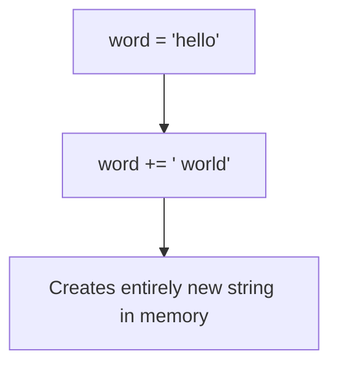

# Strings in Python

## Introduction

Strings are one of the most frequently tested data structures in coding interviews. 
Because strings are immutable in Python, many candidates accidentally write inefficient code by repeatedly concatenating strings or modifying characters in ways that cause unexpected $O(N^2)$ time complexities.

This part of the Python Interview Cookbook covers the essential string methods, common pitfalls, and algorithms necessary to ace string-related interview questions.

---

## What You Need to Know

In coding interviews, you will frequently be asked to:
- Reverse strings.
- Check for palindromes.
- Find substrings or anagrams.
- Manipulate character encodings (ASCII/Unicode).
- Parse and validate input strings.

In this section, we will cover:
- **String Fundamentals**: Creating strings, immutability, and character encodings.
- **Searching and Counting**: `find()`, `index()`, and `count()`.
- **Splitting and Joining**: `split()` and `join()`.
- **Modifying Strings**: `replace()`, `strip()`, and case conversions.
- **String Performance**: How to manipulate strings efficiently in Python.
- **Interview Recipes**: Standard templates for common string problems.

---

## Key Concept: Immutability

The most important concept to remember about Python strings is that they are **immutable**.

You cannot change a character in a string in-place. Every operation that appears to modify a string actually creates a brand new string object.

Keep this in mind as you progress through this section.

---

> **Note:** If you haven't already, make sure to read the [Mutable vs Immutable Objects](../python-foundations/mutable-vs-immutable.md) chapter in the Foundations section before proceeding.
